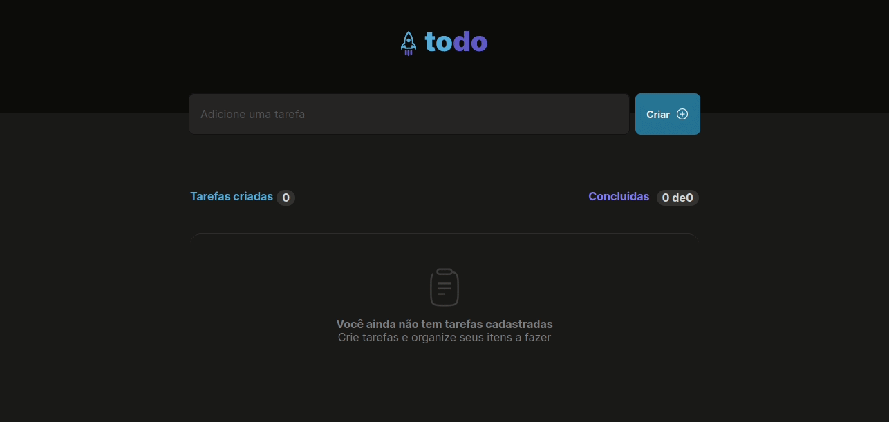

# Ignite Rocketseat Challenge

**Develop a Todolist using TypeScript in React, based on a prototype of Figma containing the features:**

* Add task.
* Mark and unmark the task as complete.
* Remove task from list.
* Task counter.

**To complete the application, it was necessary to use React concepts:**
* State
* Immutability
* Lists and keys
* Properties
* Componization

  

